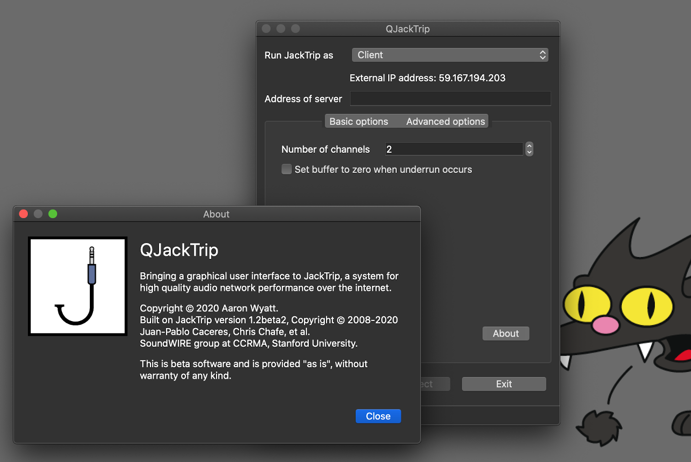

# QJackTrip
Bringing a graphical user interface to JackTrip, a multi-machine audio system used for network music performance over the Internet.

QJackTrip started as a fork of the JackTrip project before being merged into the main project itself. With the introduction of JackTrip Virtual Studios, it became the "classic mode" interface in the program, before being separated out here into its own fork again. (Things have come full circle.) Like the original fork, and JackTrip itself, it retains the original command line mode. You can run it with all the usual command line switches to launch it without the GUI.

It supports any number of channels (as many as the computer/network can handle) of bidirectional, high quality, uncompressed audio signal streaming.

It runs on several platforms, such as Linux, macOS, Windows or FreeBSD. You can use it between any combination of machines e.g., one end using Linux can connect to another using macOS.

This repository is currently a work in progress. The source code has mostly been modified to where it initially needs to be, but the build system still needs work. It should theoretically build with meson as long as you specify the "novs" option, but this is not guaranteed. In the meantime, builds for Windows and macOS can be found [here](https://www.psi-borg.org/other-dev.html).

##Important Info
It is not possible to connect to a JackTrip Labs Virtual Studio with this program. (Well, technically it might be, but not without really knowing what you are doing.) To easily connect to a Virtual Studio session, use the latest version of JackTrip itself.

Unlike JackTrip which is released under the more permissive MIT license, this program is released under the GPLv3. If you want JackTrip labs to be able to use any contributions you make, DO NOT SUBMIT CODE HERE. (At least not without also submitting it upstream.)

An early screenshot of QJackTrip

Further information and instructions are available on https://jacktrip.github.io/jacktrip/. 

Please report any security concerns to vulnerabilities@jacktrip.org
